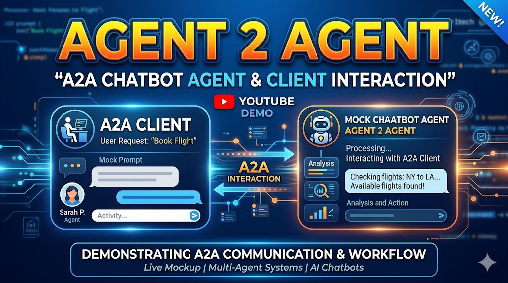

# Simulate mock chatbot as A2A Agent with simple HTTP

Expose endpoints
- agent: returns agent card for discovery
- tasks: to create a task
- tasks/{task_id}: to get task status

A2A client to interact with above agent
- polls for result
- parses response

